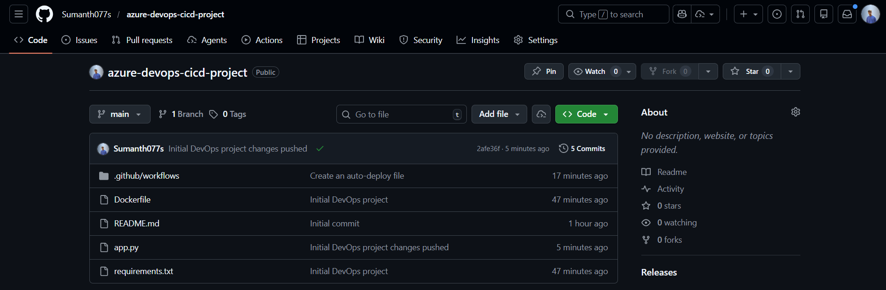
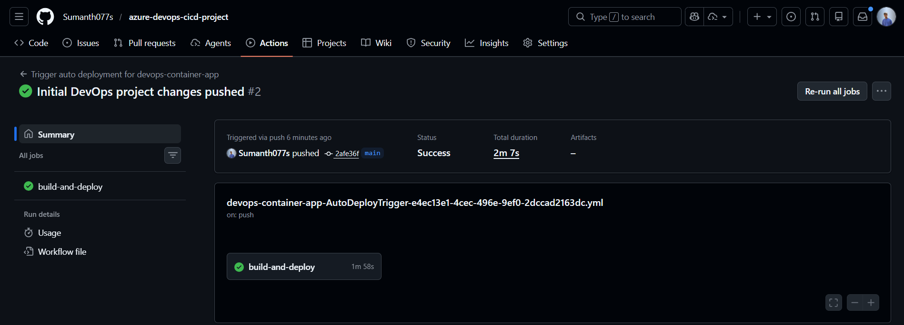
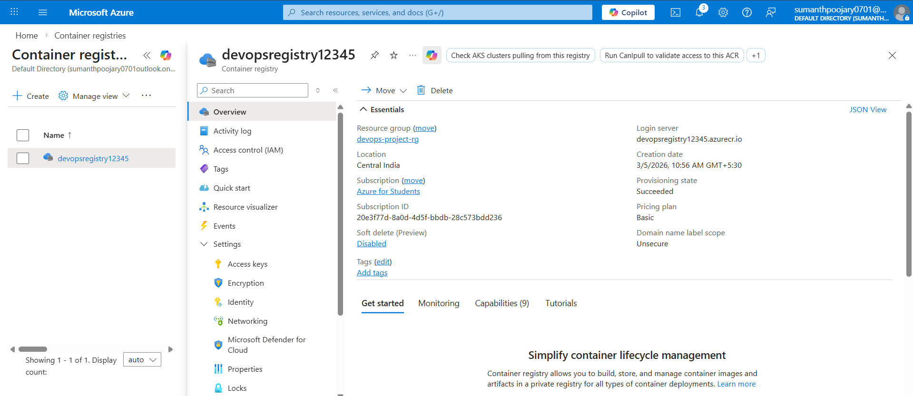
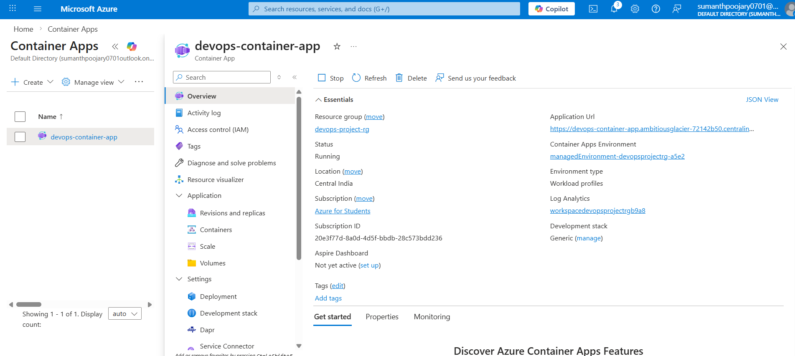
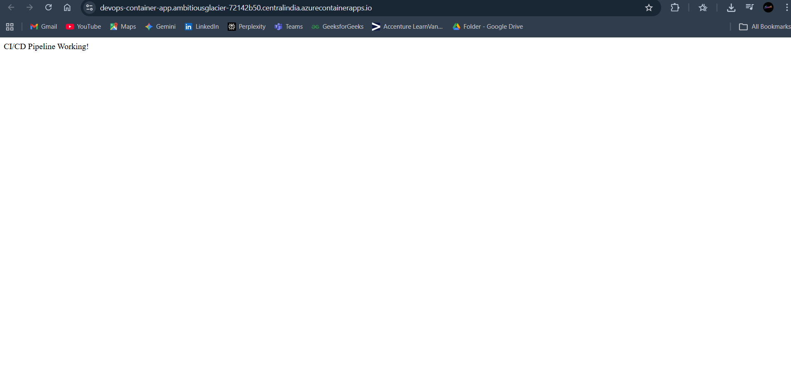

# Azure DevOps CI/CD Pipeline with Docker and Container Apps

## Project Overview

This project demonstrates a complete **DevOps CI/CD pipeline** that automatically builds, pushes, and deploys a containerized application to Microsoft Azure.

The application is built using **Python Flask**, containerized using **Docker**, and deployed automatically using **GitHub Actions**.

Whenever code is pushed to the GitHub repository, the CI/CD pipeline:

1. Builds a Docker image
2. Pushes the image to Azure Container Registry
3. Deploys the updated container to Azure Container Apps

This project showcases practical **DevOps automation and cloud deployment skills**.

---

## Architecture

Developer pushes code → GitHub repository → GitHub Actions CI/CD pipeline → Docker image build → Azure Container Registry → Azure Container Apps deployment.

---

## Technologies Used

* Python (Flask)
* Docker
* GitHub
* GitHub Actions (CI/CD)
* Azure Container Registry
* Azure Container Apps
* Azure Log Analytics

---

## Project Structure

azure-devops-cicd-project
│
├── app.py
├── requirements.txt
├── Dockerfile
└── .github/workflows
      └── deploy.yml

---

## CI/CD Pipeline Workflow

1. Developer pushes code to GitHub.
2. GitHub Actions pipeline starts automatically.
3. Docker image is built using the Dockerfile.
4. Image is pushed to Azure Container Registry.
5. Azure Container Apps pulls the image.
6. Application is automatically deployed.

---

## Application Endpoint

The application exposes a simple endpoint:

/ → Returns application status message

Example response:

"CI/CD Pipeline Working Successfully!"

---

## Screenshots

The following screenshots demonstrate the pipeline and deployment process.

1. GitHub repository with project files

2. GitHub Actions pipeline execution

3. Azure Container Registry repository with Docker image

4. Azure Container App overview page

5. Running application in browser

---

## How to Run the Project

Clone the repository:

git clone https://github.com/<your-username>/azure-devops-cicd-project.git

Navigate to the project directory:

cd azure-devops-cicd-project

Build Docker image:

docker build -t devops-app .

Run locally:

docker run -p 5000:5000 devops-app

Open browser:

http://localhost:5000

---

## Learning Outcomes

Through this project I learned how to:

* Build Docker images
* Implement CI/CD pipelines
* Automate deployments with GitHub Actions
* Use Azure Container Registry
* Deploy containers using Azure Container Apps
* Monitor containerized applications

---

## Future Improvements

* Infrastructure provisioning using Terraform
* Multi-environment deployments (dev / staging / prod)
* Monitoring with Azure Application Insights
* Kubernetes deployment using Azure Kubernetes Service

---

## Author

Sumanth U
Aspiring Cloud and DevOps Engineer
